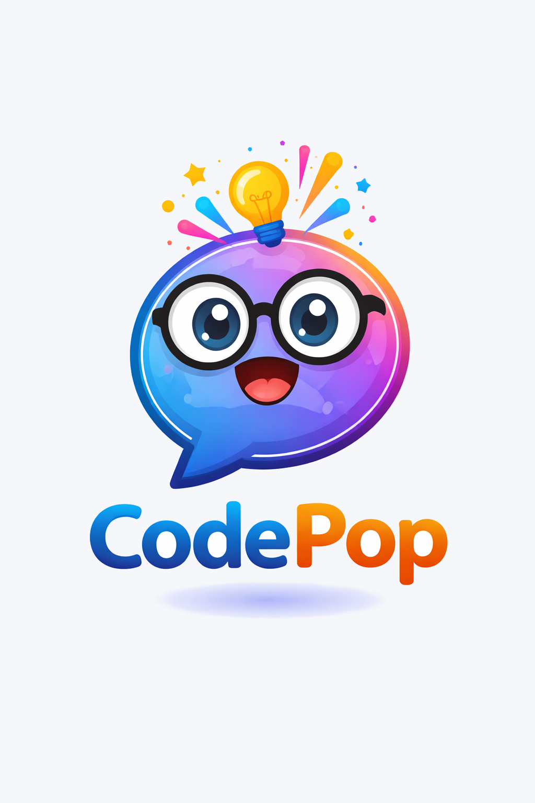
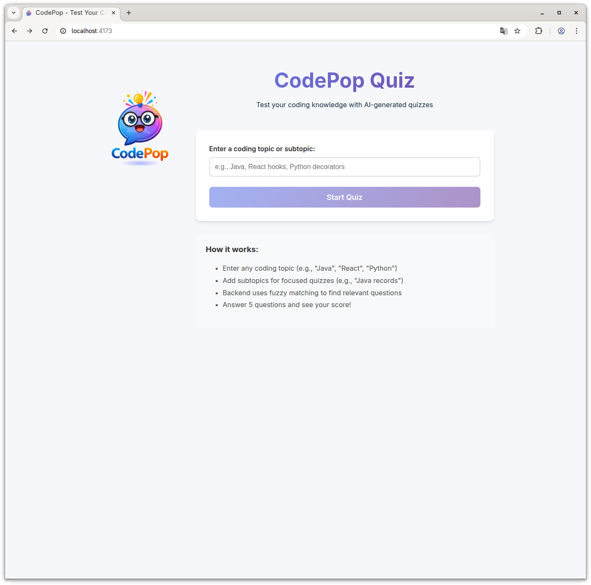
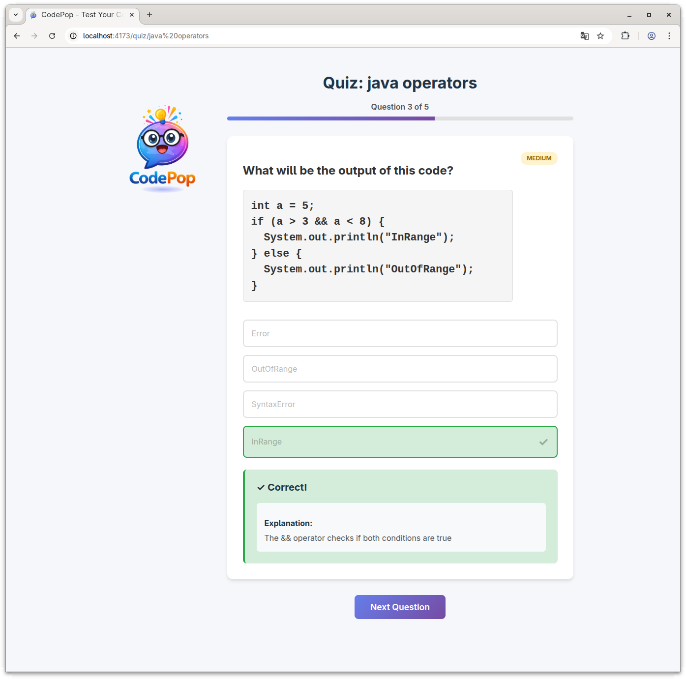

<p align="center">
  
</p>

<h1 align="center">CodePop 🎯</h1>

<p align="center">
  <em>A dynamic AI-powered quiz generator for coding topics - pop quiz yourself on anything from Java to React!</em>
</p>

## 📖 Description

CodePop generates interactive multiple-choice quizzes on coding topics using AI. Simply enter "Quiz me about **X**" where X is your chosen coding topic, and get 5 dynamically generated questions with instant feedback and scoring.

## ✨ Features

- **AI-Powered Question Generation**: Uses LLM (Ollama or cloud API) to create factual, verifiable quiz questions
- **Smart Topic Validation**: Supports 19 coding topics across backend, frontend, and mobile development
- **Intelligent Caching**: Stores generated questions in SQLite to avoid repetition within a session
- **Difficulty Levels**: Each question categorized as easy, medium, or hard
- **Graceful Degradation**: Shows partial quiz if LLM fails, with helpful notifications

## 🛠️ Tech Stack

**Backend:**
- Java 17+
- Spring Boot
- Spring Data JPA
- Spring AI - Ollama
- SQLite

**Frontend:**
- React 19
- Vite (build tool)
- React Router v7
- Axios (REST API client)
- Vitest + React Testing Library (testing)
- MSW (API mocking)

## 🎯 Supported Topics

**Backend:** Java, Python, Node.js, C#, Go, Rust, PHP  
**Frontend:** JavaScript, TypeScript, React, Vue, Angular, HTML, CSS, Svelte  
**Mobile:** Swift, Kotlin, React Native, Flutter

*Subtopics supported too (e.g., "Java Spring Boot", "React hooks")*

## 🚀 Getting Started

### Prerequisites

**Backend:**
- JDK 17 or higher
- Maven 3.6+
- Ollama installed and running locally (see Ollama Setup below)

**Frontend:**
- Node.js 18+ (LTS recommended)
- npm

### Ollama Setup

CodePop uses Ollama with the `qwen2.5-coder:7b` model for AI-powered question generation.

#### Installing Ollama

**Linux:**
```bash
curl -fsSL https://ollama.com/install.sh | sh
```

**macOS:**
```bash
brew install ollama
```

**Windows:**
Download from [ollama.com/download](https://ollama.com/download)

#### Starting Ollama

```bash
# Start Ollama service
ollama serve
```

Ollama will run on `http://localhost:11434` by default.

#### Installing the Model

```bash
# Pull the qwen2.5-coder:7b model (used by CodePop)
ollama pull qwen2.5-coder:7b
```

**Model Details:**
- **Model**: qwen2.5-coder:7b
- **Size**: ~4.7 GB
- **Optimized for**: Code generation and understanding
- **Temperature**: 0.8 (configured in backend)

#### Verifying Installation

```bash
# List installed models
ollama list

# Test the model
ollama run qwen2.5-coder:7b "What is Java?"
```

If successful, you should see a response from the model.

#### Using Alternative Models

To use a different model, update `application.properties` in the backend:

```properties
# In codepop-backend/src/main/resources/application.properties
spring.ai.ollama.chat.options.model=your-preferred-model
```

Popular alternatives:
- `codellama:7b` - Meta's code-focused model
- `deepseek-coder:6.7b` - Specialized coding model
- `mistral:7b` - General purpose model

### Running Locally

#### Backend

```bash
# Clone the repository
git clone https://github.com/mastatomba/codepop.git
cd codepop

# Run the backend
cd codepop-backend
./mvnw spring-boot:run
```

The backend will start on `http://localhost:8080`

#### Frontend

```bash
# In a new terminal, from the project root
cd codepop-frontend

# Install dependencies (first time only)
npm install

# Start the dev server
npm run dev
```

The frontend will start on `http://localhost:5173`

**Note:** Development mode uses React StrictMode which may cause duplicate API calls. To test without this behavior:
```bash
npm run build    # Build production bundle
npm run preview  # Serve on http://localhost:4173
```

## 📁 Project Structure

```
codepop/
├── codepop-backend/    # Spring Boot backend (Java + Spring Boot)
├── codepop-frontend/   # React frontend (Vite + React)
├── docs/               # Architecture and design decisions
└── README.md           # This file
```

## 🎨 How It Works

1. User enters a coding topic
2. Frontend loads previously asked questions from browser session storage
3. Backend validates topic against supported list
4. Backend checks SQLite for existing questions (excluding already-asked ones)
5. If < 5 questions available, LLM generates new questions with explanations
   - Backend passes ALL existing question texts to LLM to avoid duplicates
   - LLM sees complete history and generates questions on different aspects
6. New questions stored in database for future use
7. Frontend saves question IDs to session storage
8. User answers 5 multiple-choice questions
9. Score displayed at the end
10. Taking the same topic again shows different questions (within same session)

## 🎯 Code Style

This project enforces consistent code style using automated tools:

### Backend (Java)
- **Tool**: Spotless + Google Java Format
- **Style**: Google Java Style Guide (4-space indentation)
- **Commands**:
  ```bash
  cd codepop-backend
  ./mvnw spotless:check  # Check for violations
  ./mvnw spotless:apply  # Auto-fix violations
  ```

### Frontend (React)
- **Tools**: Prettier + ESLint
- **Style**: Standard Prettier (semi-colons, single quotes, 80 char lines)
- **Testing**: Vitest + React Testing Library + MSW
- **Commands**:
  ```bash
  cd codepop-frontend
  npm run format:check   # Check formatting
  npm run format:fix     # Auto-fix formatting
  npm run lint           # Check linting + formatting
  npm test               # Run tests
  npm run test:coverage  # Run tests with coverage
  ```

### Pre-commit Hooks
Pre-commit hooks automatically check code style before commits. To bypass in emergencies:
```bash
git commit --no-verify -m "message"
```

## 📝 License

This project is licensed under the MIT License - see the [LICENSE](LICENSE) file for details.

## 🚧 Status

**Backend:** ✅ Complete
- REST API with quiz generation
- OllamaQuizMaster implementation with qwen2.5-coder:7b
- **Delimiter-based response format** for robust LLM parsing (95%+ success rate)
- JSON fallback for backward compatibility
- Transaction isolation pattern for long-running LLM calls
- Topic validation and caching
- 50 unit & integration tests (all passing)
- Test database isolation for fast tests
- SQLite database with seeded data
- Markdown support in questions and code snippets

**Frontend:** ✅ Complete
- Full quiz flow (homepage → quiz → results)
- Immediate feedback on answers
- Markdown rendering for code blocks in questions
- Progress tracking
- Score breakdown with review
- 35 unit tests with MSW
- Responsive design

**Known Behavior:**
- React StrictMode in development may show duplicate LLM generations for new topics
- Production builds (`npm run preview`) do not have this issue
- This is expected React 18+ behavior and does not affect production

**Next Steps:**
- Session tracking across multiple quizzes
- Quiz history and statistics
- Topic autocomplete/suggestions
- Consider PostgreSQL for production (better than SQLite for concurrent writes)

## 📸 Screenshots

<p align="center">
  
  <br>
  <em>Homepage - Enter any coding topic to start your quiz</em>
</p>

<p align="center">
  
  <br>
  <em>Quiz page - Interactive questions with instant feedback and explanations</em>
</p>

---

*Built as a POC to explore AI-powered educational tools for developers*